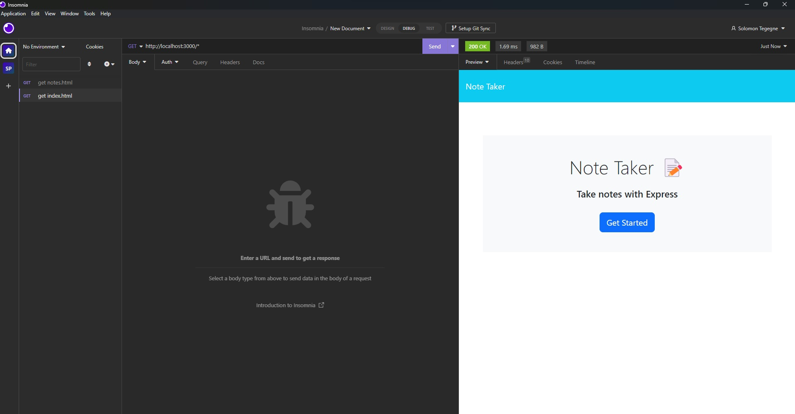
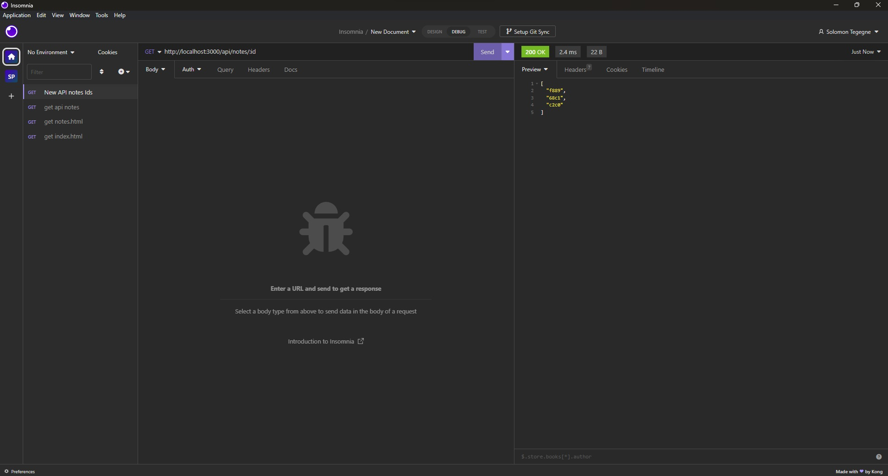

# Quick-Notes
```a Note Taking App ```
## Description 
This is a simple note-taking application built with Node.js and Express.js. It allows users to create, view, and delete notes. The application uses a JSON file as a database to store the notes.

## Features

-```Create``` Users can create a new note by providing a title and the content of the note. This information is then stored in a JSON file as a new entry.

- ```View``` Users can view a list of all the notes that have been created. This involves retrieving the data from the JSON file and displaying it to the user.

- ```Delete``` Users can delete a specific note from the list by clicking on the trash icon. This involves removing the corresponding entry from the JSON file a note.

- ```View ``` Users can view the content of a note by clicking on it in the list.

## Installation

```1.``` Clone the repository:

git clone git@github.com:solowon27/Quick-Notes.git

```2.``` Navigate to the project directory in ur terminal

Install the dependencies:
```npm install```

run ```node server.js```
# Usage
Open your web browser and go to http://localhost:3000/notes 

```1```To create a new note, enter a title and the text content in the provided input fields. Click the "Save Note" button to save the note.

```2```The list of notes will be displayed on the left side. Click on a note in the list to view its content on the right side.

```3```To delete a note, click on the trash icon next to the note in the list.

# File Structure
```server.js:``` The main server file that handles the API routes and serves the HTML files.

```public/:``` Contains the static files such as HTML, CSS, and client-side JavaScript files.

```db/db.json:``` The JSON file used as a database to store the notes.

# Dependencies
The application uses the following dependencies:

```express:``` Fast, unopinionated, minimalist web framework for Node.js

```path:``` Node.js module for working with file and directory paths

```fs:``` Node.js module for interacting with the file system
# Deployment

```heroku``` https://pure-shelf-29336-362df3274b0d.herokuapp.com

```Github``` https://github.com/solowon27/Quick-Notes

# Examples 

The following screenshoots show HTTP requests in insomnia and you can also see more images inside Assets folder:




# Credit 
Github Copilot helpme out on the addNote and deleteNote requests
# Contributing
Contributions are welcome! If you find any issues or have suggestions for improvements, please open an issue or submit a pull request on the GitHub repository.

# License
This project is licensed under the ```MIT License```.
# Contact 
for more information about the app please contact me through solowon@hotmail.com

By ```Solomon Tegegne``` with ```University of Utah coding bootcamp``` July 2023


